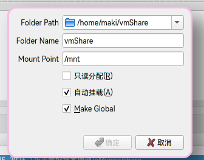

本教程说明如何在主机以及Linux虚拟机之间建立共享文件夹。
## VMware
TODO

## VirtualBox
虚拟机打开时，点击左上角的`设备` -> `安装增强功能`
如果没有反应或者提示失败，可以自行[下载](https://download.virtualbox.org/virtualbox/)，选择最新的版本，此时是VBoxGuestAdditions_7.2.4.iso

进入虚拟机：
```
sudo apt update  
sudo apt install -y build-essential dkms
```
下载好后再次点击`安装增强功能`即可。


在 VirtualBox 设置共享文件夹

1. 打开虚拟机 → 选择 设置 (Settings) → 共享文件夹 (Shared Folders)
2. 点击 添加文件夹 (Add Folder)
3. 文件夹路径 (Folder Path)：选择主机的文件夹
4. 文件夹名称 (Folder Name)：给虚拟机用的名称
5. 挂载点 (Mount Point)：注意文件夹需要存在
6. 自动挂载 (Auto-mount)：勾选


重启后查看是否已经挂载成功
ls /mnt
如果有出现主机上文件夹内的文件，那么已经成功。
如果没有输出，尝试手动挂载
```bash
sudo mount -t vboxsf (设置的Folder name) /mnt
```
这时候ls /mnt应当有显示文件夹内容了。