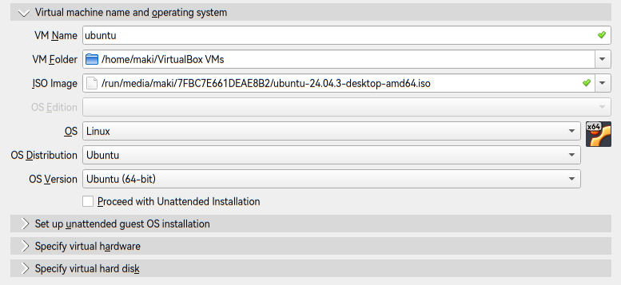
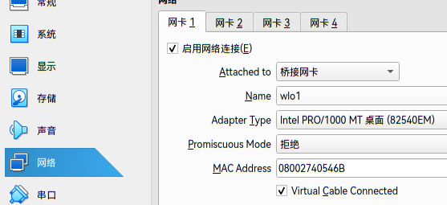
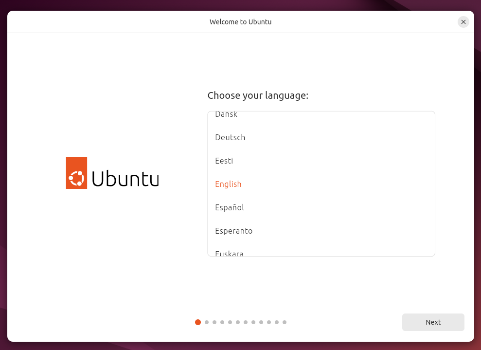
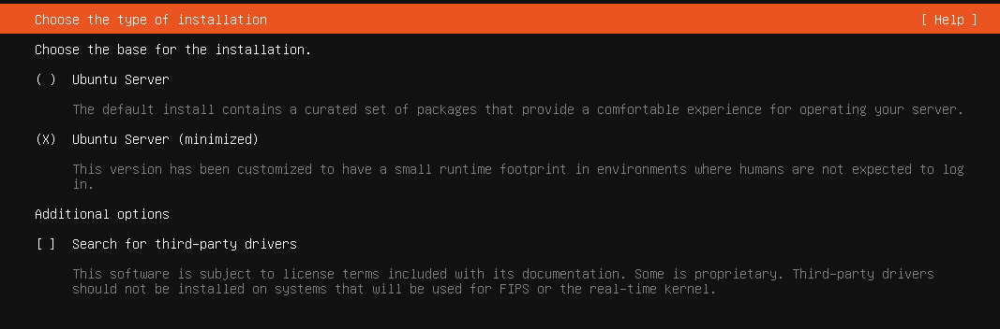
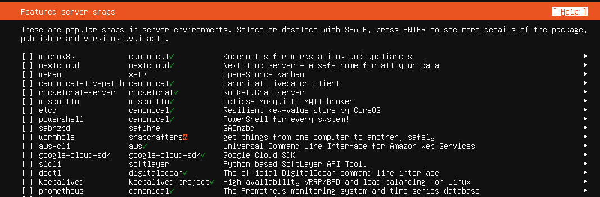
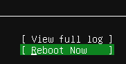
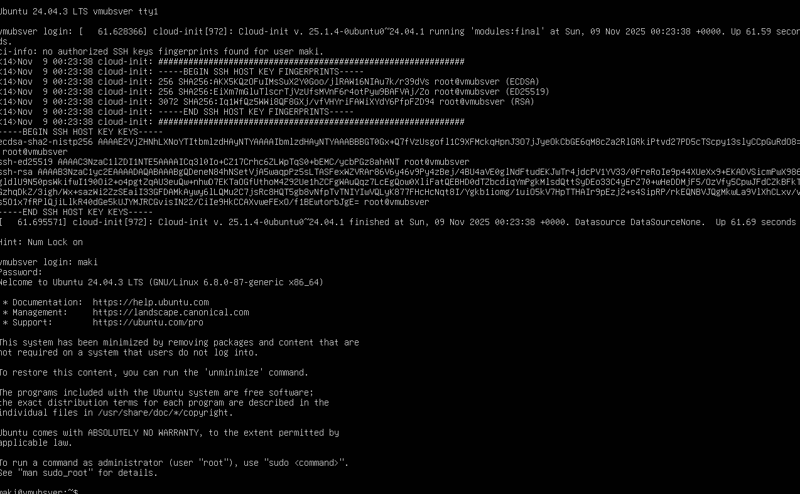

# 本教程使用Ubuntu24.04.03 LTS
前往resources页面下：载[resources](../resources.md)
## VMWare
TODO


## VirtualBox
1. 下载好ISO文件后，点击左上角的“新建”

2. 填入虚拟机名字，例如`ubuntu` ，取消勾选`Proceed with Unattended Installation`

3. 展开`Specify virtual hardware`,可以更改虚拟机性能

建议保留默认设置即可，后续搭建集群要多开，不建议加大内存。
点击完成。
4. **先别启动虚拟机**，点击设置

5. 在“网络”>“网卡1”>Attached to,更改为桥接网卡，英文为`Brige`模式。

> [!info]
> 该模式下虚拟机拥有独立的IP,只有这样，主机以及各虚拟机之间才能进行通信。
> **校园网没有DHCP**,需要自己手动分配IP.如果不行建议使用自己的路由器或手机热点即可。
> 如果环境不允许桥接模式，使用NAT模式可以上网，但是NAT模式没有单独的IP,只有不需要集群的实验可以使用NAT模式完成。
> 

点击确定。
启动虚拟机。

如果无法启动，请搜索“电脑型号+进入BIOS”以及“电脑型号+启用虚拟化“

> [!info]
> 
> 请在目录中选择Desktop/Server安装


## Ubuntu Desktop安装教程
<div id="ubuntudesktop"></div>
1. 点击try or install ubuntu

2. 选英文选英文选英文选英文选英文选英文选英文选英文

>强烈建议在使用Linux系统时默认使用英文作为首选语言，输入法问题可通过安装fcitx5或者ibus解决。

3. 一直下一步就可以了
>如果你是真机安装，那么还是请注意每一步的意义清楚每一步的后果。

4. 设置名字和主机名、密码等

>其实这一步就可以直接叫hadoop了，后续实验基本用不上默认用户。
>密码建议非常弱小的密码，因为后续我们将会一遍又一遍地频繁输入，你也不想每次都输入大小写字母数字+特殊符号的密码吧...真机看自己
>取消勾选`Require my password to log in`，方便。

下一步，选择时区后点击安装即可。

安装完成后会提示`重启/继续试用ubuntu`，重启即可进入全新的ubuntu系统。

### 重启后安装基本软件

```bash
sudo apt update
sudo apt install -y wget curl vim nano zip unzip tar openssh-server htop lsof git net-tools
```
## Ubuntu Server安装教程
1. 选择`Try or install ubuntu`
2. 选英文选英文选英文选英文选英文！！

>强烈建议在使用Linux系统时默认使用英文作为首选语言，输入法问题可通过安装fcitx5或者ibus解决。


3. 然后一直`Enter`
4. 通过`Tab`切换选择，安装minimized

5. 下一步是网络配置，这一步确保之前选择了`桥接`模式，会发现已经自动帮我们配置好了新的IP。

6. 一直下一步，会到选择镜像(mirror)配置，会自动选择镜像站，正常测试到清华源即可

7. 存储配置也是默认即可

>真机这一步必须谨慎配置，尤其是和Windows共存一块硬盘的情况，一不小心windows就需要修复引导才能启动或者直接清空win的分区了 

一直下一步，在最后选择`Continue`继续即可。
8. 配置用户名、主机名以及密码

>其实这一步就可以直接叫hadoop了，后续实验基本用不上默认用户。
>密码建议非常弱小的密码，因为后续我们将会<u>一遍又一遍地频繁输入</u>，你也不想每次都输入*大小写字母数字+特殊符号*的密码吧...真机看自己
9. 一直下一步，选择安装openssh-server

>忘记勾选也没事，后续sudo apt install openssh-server就可以了

10. 这一步是问你是否要预装一些服务器应用，我们用不上，后续需要使用也可以手动安装，这一步选择`Done`就开始安装系统了

11. 等待一会后，选择`Reboot Now`，一会会提示你拔出安装媒介，不必操作按Enter，随后即可进入全新的Ubuntu Server

12. 输入用户名以及密码即可登录进入系统

> [!warning]
> 公网主机请勿展示sshkey
### 设置时区
ubuntuserver默认使用UTC时区，Hadoop对分布式节点时间要求很高，否则日志和任务调度会出错。
要么集群统一用UTC，但建议还是都调回东八区。
```
sudo apt install -y chrony
sudo systemctl enable chrony
sudo systemctl start chrony
sudo timedatectl set-timezone Asia/Shanghai
```
输入date回车，看见和自己主机时间一致即可。

### 安装基本软件
先执行
```bash
sudo apt update
```

```bash
sudo apt install -y wget curl vim nano zip unzip tar openssh-server htop lsof git net-tools
```
