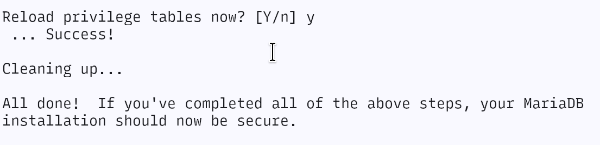
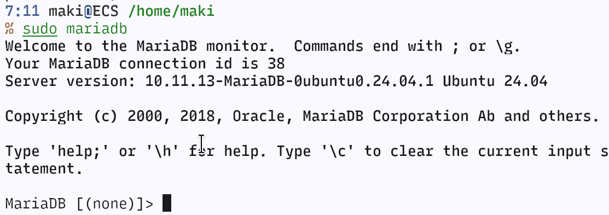
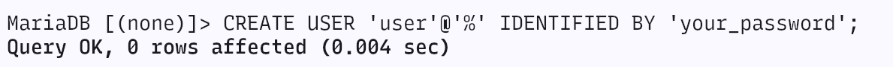
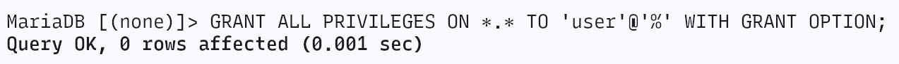

## 安装 mysql(mariadb)

1. 连接 ECS 服务器

```bash
ssh 用户名@ECS公网IP
```

2. 安装 MySQL(此处以 Ubuntu24.04 为例)

```bash
sudo apt update
sudo apt install mariadb-server -y
sudo systemctl start mariadb
sudo systemctl enable mariadb // 开机自启
```

3. 检查运行状态

```bash
sudo systemctl status mariadb
```


> mariadb 正常运行中

## 配置 mysql

1. 执行安装引导

```bash
sudo mysql_secure_installation
```

按照提示输入 root 密码后，进入选项
第一个选项根据提示选 n 即可


删除匿名用户


禁止 root 远程连接


删除 test database


刷新 privileges
 2. 进入 mariadb

```bash
sudo mariadb
```

 3. **创建用户并允许远程访问：**  
 假设密码是 `your_password`，远程 IP 可以用 `%` 表示任意 IP：

```mysql
CREATE USER 'user'@'%' IDENTIFIED BY 'your_password';
```

> %指任意 ip 地址，或填写本机所在 ip 地址
> 

4. 授予权限（例如授予所有数据库的所有权限）：

```mysql
GRANT ALL PRIVILEGES ON *.* TO 'user'@'%' WITH GRANT OPTION;
```



> 若只赋予某个 database，将" \*.\* "改为 " DATABASE.TABLE " ，对应你要赋予的数据库和表即可。

5. 刷新 PRIVILEGES
   
6. 退出 mysql

```mysql
exit
```

## 修改配置文件允许远程访问

编辑配置文件 `/etc/mysql/my.cnf

```cnf
[mysqld]
bind-address = 0.0.0.0
```


> 或使用`sudo mariadb --verbose --help | grep -A 1 "Default options"`查看正在使用哪个配置文件

重启 mariadb

```bash
sudo systemctl restart mariadb
```

回到本机，远程连接我们的数据库

```bash
mariadb -u user -p -h ip地址 --ssl=0
```

> user 是创建的 mysql 用户名，ip 地址为 ECS 的公网地址，--ssl=0 指取消加密传输，若有 ssl 证书也可自行配置
